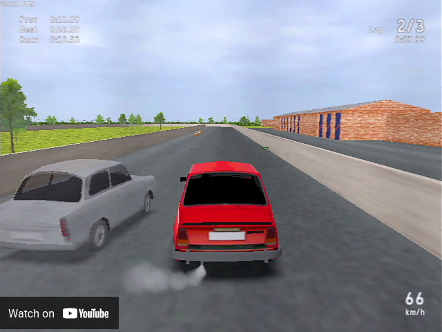

# OpenMRac

[](https://youtu.be/r3hLTo5Nu1g)

OpenMRac is a split-screen racing game. It is a tweaked source release of [MultiRacer](https://www.franticware.com/multiracer).

Programming was done by Vojtěch Salajka.  
Porting to big endian architectures for Amiga-like OSes was done by [Szilárd Biró](https://github.com/BSzili).

⚠️ Beware! The source code is old and messy, plus most comments are in Czech 😁

Creating forks and porting to additional platforms is encouraged, but these typically will not be merged back to the main repo. The same applies to mods.

Franticware claims rights to the name "MultiRacer" which should not be used by other parties for their products or ports. That is the reason for changing the title to OpenMRac, to which no such restrictions apply.

Game data files are in a separate repository under a different license: https://github.com/Franticware/OpenMRac-data

# Installation Instructions

## Windows

Download here: https://www.franticware.com/openmrac

## Linux

### Arch-based (Arch, Manjaro, EndeavourOS, ...)

Install **openmrac** package from AUR

### Debian-based (Debian, Raspberry Pi OS, Ubuntu, MX Linux, Mint, ...)

* The openmrac and openmrac-data packages are now available in many Debian-based distributions. If not, please use method described in the following section (Other).

* Note: The openmrac-es2 package is planned (OpenGL ES 2.0 variant) which might be better suited for SBCs based on RISC-V and ARM.

### Other (openSUSE, Fedora, ...)

```
git clone https://github.com/Franticware/OpenMRac-data.git
cd OpenMRac-data
make install
cd ..

git clone https://github.com/Franticware/OpenMRac.git
cd OpenMRac/src
make -f Makefile.linux install
cd ../..
```

## Mac OS X
TODO

# Branches

* [main](https://github.com/Franticware/OpenMRac/tree/main) - current SDL 2 version, OpenGL with shaders
* [legacy](https://github.com/Franticware/OpenMRac/tree/legacy) - older SDL 1.2 version, OpenGL 1.x (no shaders)
* [dos-3dfx](https://github.com/Franticware/OpenMRac/tree/dos-3dfx) - version for DOS with 3dfx cards, based on the legacy branch
